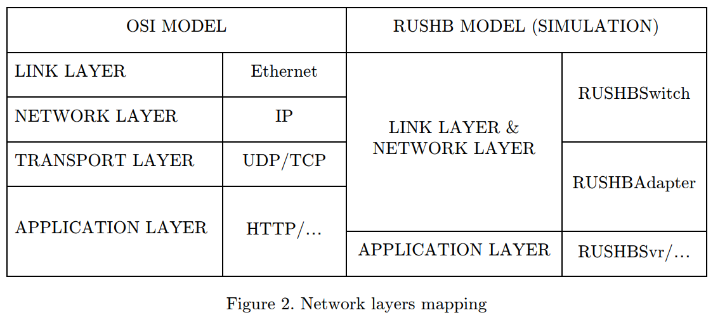
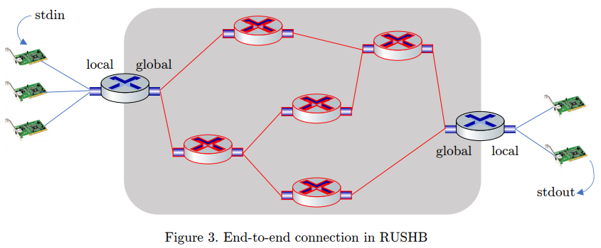
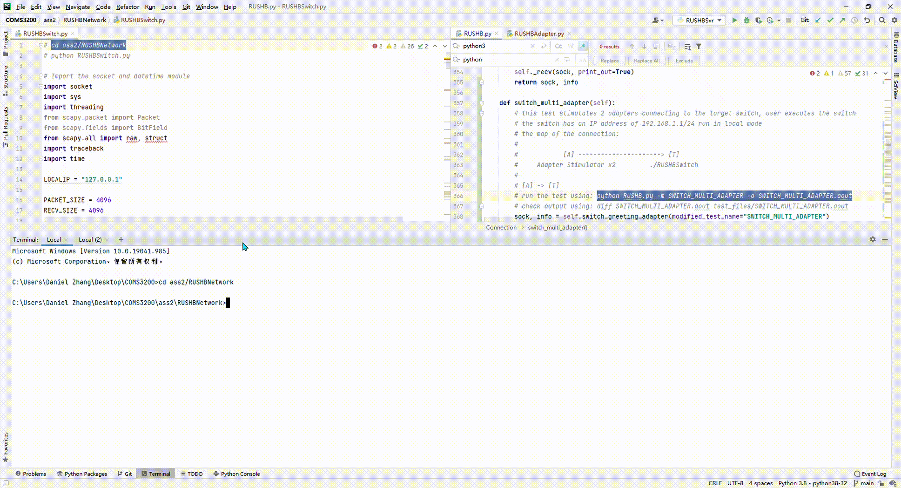

# Computer Networks
UQ COMS

OSI & Internet reference models. Communication protocols for Local, Metropolitan & Wide Area Networks. BISDN networks. The Internet protocol suite. Mobile Networks. Quality of service in communication protocols. Network security. Trends in communication networks.
The course is based around the Internet protocol stack and works through the layer of the protocols.
Firstly, fundamental principles and metrics for computer networking are described, and the overall architecture of the Internet is described.
The application layer looks at protocols such as HTTP, DNS, SMTP.
The transport layer looks at UDP and TCP.
The network layer looks at IPv4, IPv6, and routing algorithms and protocols.
The Link Layer looks at Ethernet, Link layer Addressing, and ARP.
The physical layer is not considered in detail.

## Helpful learning resources
• Computer Networking: A Top-Down Approach, 7th Edition (2017) James F. Kurose, University of Massachusetts, Amherst Keith W. Ross, Polytechnic University, Brooklyn
Wireshark network protocol analyser.  
We are using this tool in the labs - you can download a copy for free to use on your own computer  
https://www.wireshark.org/  

## Assignment 1 - RUSHBSvr (Application layer)
how to run:
```shell
python RUSHBSvr.py
```
it will generate a port number, say it will be 61606, then we open another terminal to run:
```shell
python RUSHBSimpleClient.py 12345 61606
```
Here 12345 is our client port number
for more details of the parameter can check the code in main method 
```shell
def main(argv):
    print('RUSHB_CLIENT_VERSION: ' + RUSHB_TESTCLIENT_VERSION)
    if len(argv) <= 2 or not argv[1].isdigit() or not argv[2].isdigit():
        print("Usage: python3 RUSHBSimpleClient.py client_port server_port [-v] [-m mode] [-o output]")
        return

    my_port = int(argv[1])
    serv_port = int(argv[2])

    debug_level = 2
    mode = SIMPLE_MODE
    output = sys.stdout
    for i, arg in enumerate(argv[3:]):
        if arg == "-v" and argv[i + 4] in ("0", "1", "2", "3", "9", "10"):
            debug_level = int(argv[i + 4])
        elif arg == "-m":
            mode = {"SIMPLE": SIMPLE_MODE, "NAK": NAK_MODE, "MULTI_NAK": MULTI_NAK_MODE, "TIMEOUT": TIMEOUT_MODE,
                    "MULTI_TIMEOUT": MULTI_TIMEOUT_MODE, "INVALID_SEQ": INVALID_SEQ_MODE,
                    "INVALID_ACK": INVALID_ACK_MODE, "INVALID_FLAGS": INVALID_FLAGS_MODE,
                    "ENCODED": ENCODED_MODE, "CHECKSUM": CHECKSUM_MODE, "ENCODED_CHECKSUM": ENCODED_CHECKSUM_MODE,
                    "INVALID_ENCODE_VAL": INVALID_ENCODE_VAL_MODE, "INVALID_CHECKSUM_VAL": INVALID_CHECKSUM_VAL_MODE,
                    "INVALID_ENCODE_FLAG": INVALID_ENCODE_FLAG_MODE, "INVALID_CHECKSUM_FLAG": INVALID_CHECKSUM_FLAG_MODE
                    }.get(argv[i+4].upper(), SIMPLE_MODE)
        elif arg == "-o":
            output = open(argv[i+4], "w")

    conn = Connection(LOCALHOST, my_port, LOCALHOST, serv_port, output, debug_level)
```

## Assignment 2 - RUSHBAdapater & RUSHBSwitch (Link & Network layer)
This assignment introduces the use of Network Layer and Link Layer (from OSI Models) as well as socket programming (simulation) on each of these devices: adapters, switches and routers. After finishing the assignment, I understanded how data is sent throughout the internet.  
<p align="center">
  
</p>
RUSHBAdapter is supposed to work as an adapter for one process only through TCP (e.g. RUSHBSvr). The process that connects to RUSHBAdapter needs to open a socket under localhost (127.0.0.1) as a listener under an available port (assigned by the kernel). However, in this assignment, the RUSHBAdapter is not required to listen to any processes, instead, it will listen to stdin (see the figure below).  
RUSHBSwitch works like a network router, and it can be local or global. A local RUSHBSwitch can listen to many RUSHBAdapter through a UDP and connect to many global RUSHBSwitches through TCP. In the meantime, the global RUSHBSwitch cannot listen to any RUSHBAdapter, but can connect to other RUSHBSwitches. This is a diagram explaining how RUSHBAdapters and RUSHBSwitches are connected:
<p align="center">
  
</p>
The final goal for this programming assignment is sending and receiving data across the global network without losses and errors. Data can be anything that can attached to the adapter, such as netcat, or RUSHBSvr, or even stdin (as in this assignment). 

how to run:
```shell
python RUSHBSwitch.py {local|global} {ip} [optional_ip] {x} {y}
```
RUSHBSwitch will generate a port number, say it will be 61606, then we open another terminal to run:
```shell
python RUSHBAdapter.py 61606
```
Examply running through RUSHB.py is below, in this example, we test the functionality of RUSHBSwitch with given RUSHBAdapter simulator.
<p align="center">
  
</p>

# What I learned: 
- Describe the architecture of the Internet and the functions of each component.
- Describe functionality and design principles of communication protocols in various layers of the Internet reference model.
- Understand network security threats and their countermeasures
-	Design and implement computer networking protocols based on RFC standards.
-	Analyse computer network traffic using a network protocol analyser tool.
